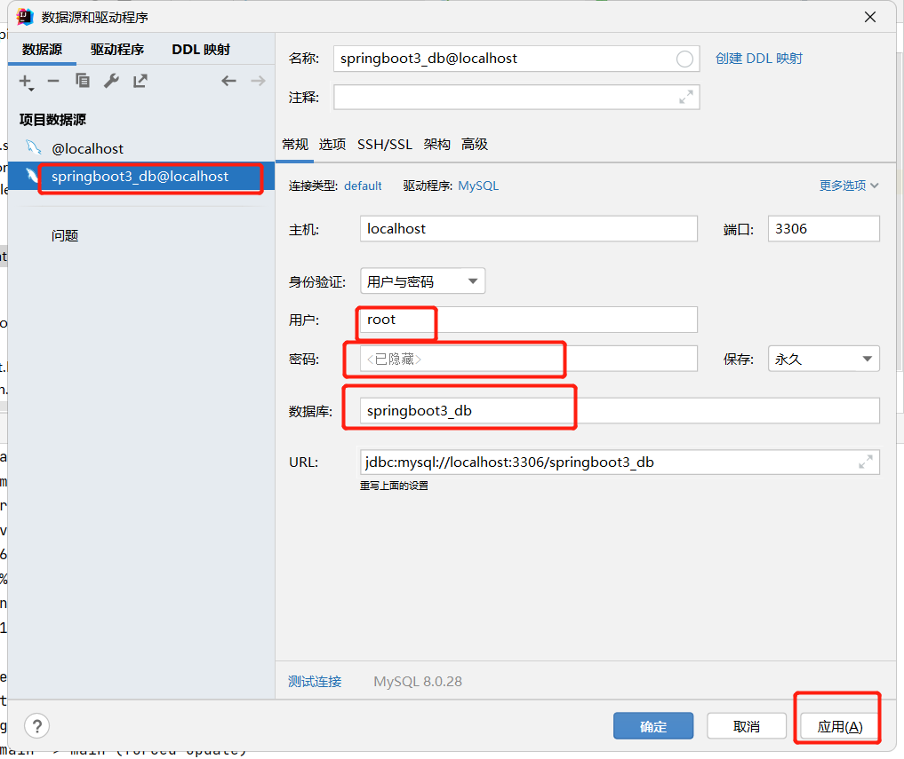
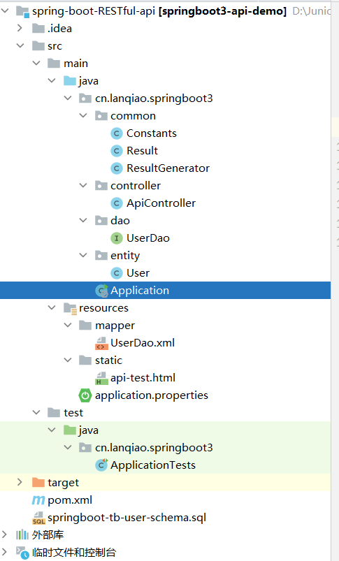
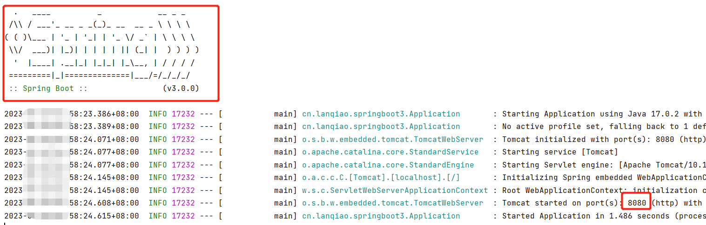
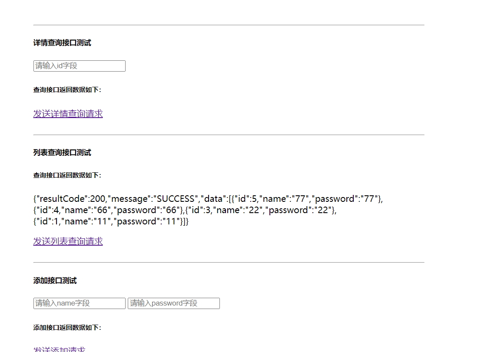

# RESTfulAPI

# 一、简介

Spring Boot 项目实践之 RESTful API 设计与实现

# 二、部署

全部pull到本地，运行sql创建一下数据库和表（看.sql文件），idea中连接



修改application.properties中的

```
spring.datasource.username=root
spring.datasource.password=你的密码
```



# 三、运行

运行Application，显示



后，在浏览器输入`http://localhost:8080/api-test.html`就可以访问



# 四、总结

## （一）Spring boot

Spring Boot基本上是Spring框架的扩展，它消除了设置Spring应用程序所需的XML配置，为更快，更高效的开发生态系统铺平了道路。

## (二）启动

在 IDEA 编辑器中，有两种方式可以启动 Spring Boot 项目，分别是： - 工具栏中的 Run / Debug 按钮 - 右键运行 Spring Boot 的主程序类

由于 IDEA 编辑器对于 Spring Boot 项目的支持非常友好，在项目导入成功后会被自动识别为 Spring Boot 项目并进行相关配置

与普通的 Web 项目相比，启动项目减少了几个中间步骤，不用去配置 Servlet 容器，也不用打包并且发布到 Servlet 容器再去启动，而是直接运行主方法即可启动项目，开发调试都十分方便也节省开发时间。
